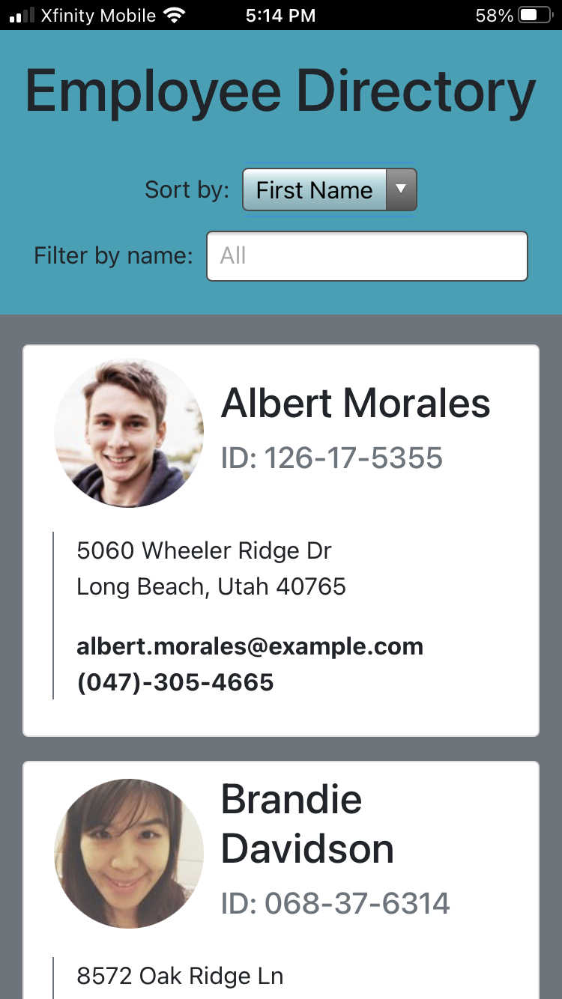
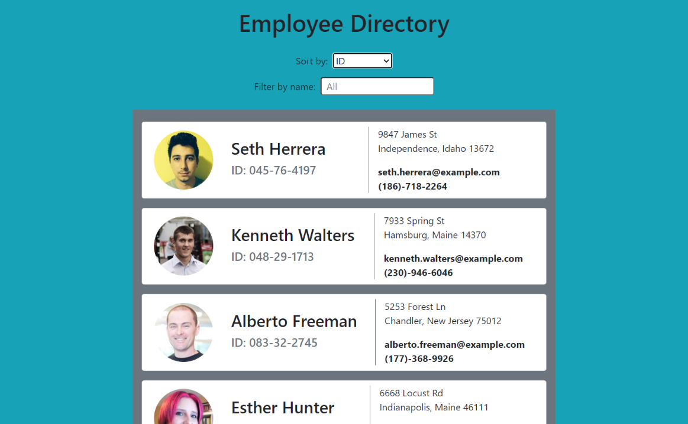

# Employee Directory
<div>
  
  


</div>

### React app that allows a manager to quickly access information on all their employees

<br>


<br><br>

## Table of Contents  
* [Features](#Features)  
* [Installation](#Installation)  
* [Usage](#Usage)  
* [Technologies](#Technologies-Used)
* [Contributing](#Contributing)  
* [Future Scope](#Future-Scope)  
* [Questions](#Questions)

## Features
- Random set of employees generated using the [Random User API](https://randomuser.me/)
- Sort employees by first name, last name, or employee ID#
- Text input with dropdown menu to filter employees by name
- Downloadable as Mobile/Desktop Progressive Web App

## Installation
1. Download project by clicking ![Code button][Code] at the top of this repository (make sure you are in `main` branch, **not** `gh-pages`), and open project directory in terminal.
2. Install all dependencies:
    ```
    npm i
    ```

## Usage
Currently deployed with [GitHub Pages](Deployed)

1. When the page loads, a table will be populated with 20 random employees. Each employee card displays a photo, full name, employee ID, address, email and phone number.
2. Select an option from the first dropdown to sort employees by first name (default), last name, or by ID number.
3. Start typing in the filter input or select name from dropdown to search for a particular employee.


<br><br>

## Technologies Used
- [React](https://reactjs.org/)
- [Random User API](https://randomuser.me/)

## Contributing
Contributions welcome!
1. Fork this repository  
2. Create a new branch  
3. Commit/push your changes  
4. Create a new pull request  

## Future Scope
- Cache users with service worker for offline functionality
- Integrate a backend API/login system & allow users to add/remove employees

## Questions  
If you have any questions, feel free to create an [Issue][Issues] or contact me directly at <dore.joel.dore@gmail.com>

## License
This project is [MIT][License] licensed.  
© 2021 [Joel Dore](https://github.com/JoelDore)  

---
<br>

<!-- Contact/Social Links -->
<div align="center">

[](mailto:dore.joel.dore@gmail.com) 
[](https://github.com/JoelDore) 
[](https://www.linkedin.com/in/joeldore) 
<a href="https://www.buymeacoffee.com/JoelDore" target="_blank"></a>

</div>

<!-- Links -->
[Code]: https://img.shields.io/badge/-%E2%A4%93%20Code%20%E2%8F%B7-brightgreen
[Deployed]: https://joeldore.github.io/employee-directory/
[Issues]: https://github.com/JoelDore/employee-directory/issues
[License]: https://github.com/JoelDore/employee-directory/blob/main/LICENSE